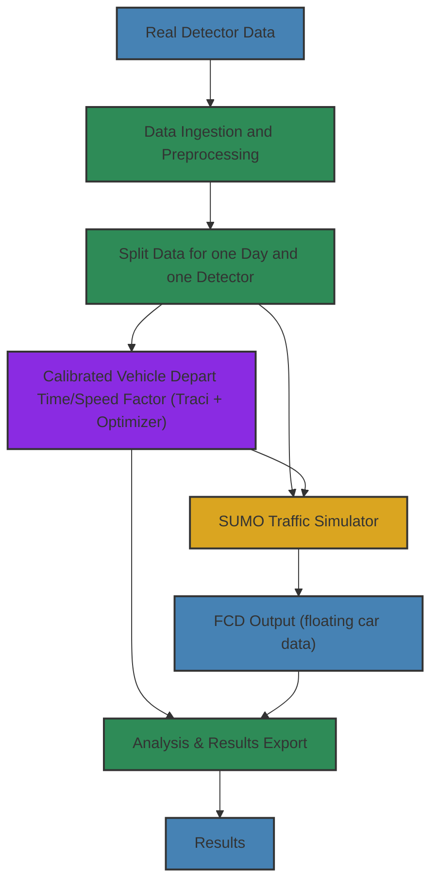
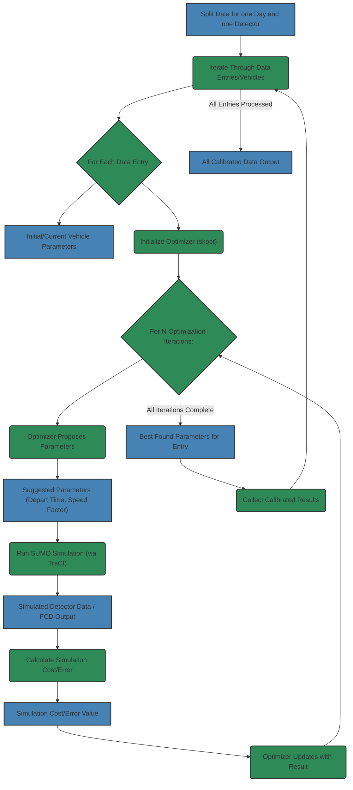

# Hornsgatan Traffic Simulation and Calibration Project Workflows

This document outlines the project's data processing and simulation workflows.

---

## High-Level Project Workflow

Overview of the main stages in the Hornsgatan traffic simulation and calibration project.

The project uses a modular Hamilton pipeline with these main steps:

1.  **Data Ingestion & Preprocessing:** Import and process real detector data for simulation and calibration.
2.  **Calibration:** Calibrate vehicle parameters against real data using Bayesian optimization (scikit-optimize) to minimize simulation-to-real data difference.
3.  **Traffic Simulation:** Run SUMO scenarios to produce traffic flow data.
4.  **Analysis & Export:** Analyze and export simulation and calibration results.

Each stage is a Hamilton dataflow, triggered via `main.py`.

Available pipelines:

-   `import_data`: Data ingestion and preparation.
-   `calib`: Calibration process.
-   `sim`: Traffic simulation.

Hamilton manages step dependencies for a clear and maintainable workflow. 

---

## High-Level Dataflow Diagram

---

## Low-Level Calibration Workflow

Detailed workflow of the calibration process, finding optimal vehicle parameters by iteratively using real data, SUMO via TraCI, and skopt.

---

### Explanations:

*   **Simulation Cost/Error:**
Metric quantifying how well simulation output (with suggested parameters) matches real data for an entry. A numerical value minimized by the optimizer. Lower = better match.
Cost function formula:

$$(t_{sim} - t_{real})^2 + (v_{sim} - v_{real})^2$$

*   **Calibration Iterations & Best Parameters:**
Skopt optimizer runs for fixed iterations (`iteration`) per entry. It proposes parameters to minimize cost. After iterations, the parameters with the lowest cost found are the **Best Found Parameters for Entry**.
    Where:
    -    $t_{sim}$, $v_{sim}$: simulated detection time/speed.
    *   $t_{real}$, $v_{real}$: real observed time/speed.
    *   $f_{speed}$, $t_{depart}$: vehicle speed factor/depart time parameters calibrated.
    *   $f_{speed}^{min/max}$, $t_{depart}^{min/max}$: parameter bounds.

*   **Suggested Parameters (Depart Time, Speed Factor):**
Values proposed by the optimizer in an iteration, aiming for lower costs based on Bayesian optimization.

*   **Optimizer Updates:** Suggested parameters and their cost are fed back to the optimizer. This update refines its model for better future suggestions.
