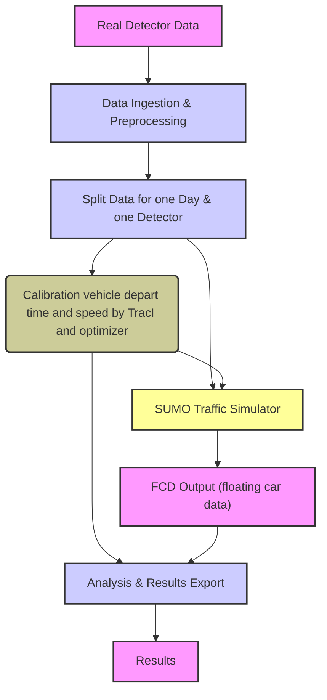

# High-Level Project Workflow

This document provides a high-level overview of the data processing and simulation workflow within the Hornsgatan traffic simulation and calibration project.

The project is designed as a modular pipeline, orchestrated by the Hamilton library, to perform the following main steps:

1.  **Data Ingestion and Preprocessing:** Real detector data is imported and processed to be used for simulation scenario generation and calibration.
2.  **Simulation Scenario Generation:** Based on the processed data, scenarios for the SUMO traffic simulator are generated.
3.  **Traffic Simulation:** The generated scenarios are run using the SUMO microscopic traffic simulator. The simulations produce output data that reflects the traffic flow under specified conditions.
4.  **Calibration:** Utilizing Bayesian optimization (with scikit-optimize), vehicle parameters within the simulation are calibrated against the real detector data. This step aims to minimize the difference between simulated and observed traffic patterns.
5.  **Analysis and Results Export:** The results from simulations and calibration are analyzed and can be exported for further investigation or visualization.

Each of these stages, particularly the data processing, simulation execution, and calibration, are implemented as Hamilton dataflows. The `main.py` script acts as the central entry point to trigger these different pipelines.

The three main pipelines available are:

-   `import_data`: Handles the initial data ingestion and preparation.
-   `sim`: Executes the traffic simulation based on generated scenarios.
-   `calib`: Runs the calibration process.

By using Hamilton, the dependencies between the steps within and across these stages are explicitly managed, ensuring a clear and maintainable workflow. 

## High-Level Dataflow Diagram

