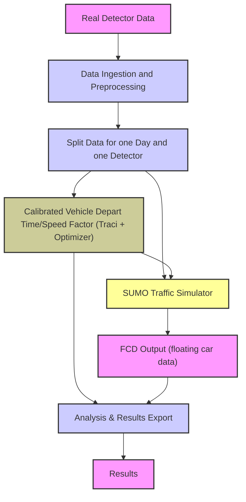
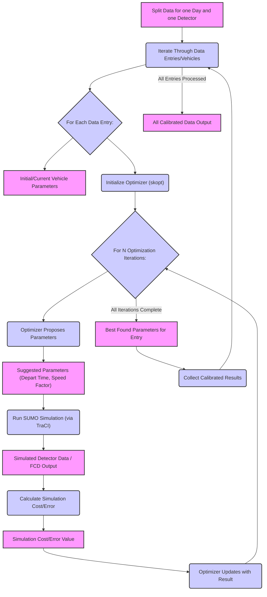

# Hornsgatan Traffic Simulation and Calibration Project Workflows

This document outlines the key data processing and simulation workflows within the Hornsgatan project, presented at both a high level and a detailed low level for the calibration process.

## High-Level Project Workflow Overview

This section provides a high-level overview of the main stages of the Hornsgatan traffic simulation and calibration project's data processing and simulation workflow.

The project is designed as a modular pipeline, orchestrated by the Hamilton library, to perform the following main steps:

1.  **Data Ingestion and Preprocessing:** Real detector data is imported and processed to be used for simulation scenario generation and calibration.
2.  **Traffic Simulation:** The generated scenarios are run using the SUMO microscopic traffic simulator. The simulations produce output data that reflects the traffic flow under specified conditions.
3.  **Calibration:** Utilizing Bayesian optimization (with scikit-optimize), vehicle parameters within the simulation are calibrated against the real detector data. This step aims to minimize the difference between simulated and observed traffic patterns.
4.  **Analysis and Results Export:** The results from simulations and calibration are analyzed and can be exported for further investigation or visualization.

Each of these stages, particularly the data processing, simulation execution, and calibration, are implemented as Hamilton dataflows. The `main.py` script acts as the central entry point to trigger these different pipelines.

The three main pipelines available are:

-   `import_data`: Handles the initial data ingestion and preparation.
-   `sim`: Executes the traffic simulation based on generated scenarios.
-   `calib`: Runs the calibration process.

By using Hamilton, the dependencies between the steps within and across these stages are explicitly managed, ensuring a clear and maintainable workflow. 

## High-Level Dataflow Diagram

## Low-Level Calibration Workflow Details

This section provides a detailed look at the steps involved in the calibration process. This workflow aims to find optimal vehicle parameters (depart time and speed factor) by iteratively using real detector data, the SUMO simulator via TraCI, and a Bayesian optimizer (skopt).

### Explanations:

*   **Simulation Cost/Error:** This metric quantifies how well the SUMO simulation output, using a given set of vehicle parameters, matches the real-world detector data for a specific vehicle or data entry. It is calculated as a numerical value that the optimizer attempts to minimize. A lower value indicates a closer match between the simulated and real observations. Based on the `features_calib.py` implementation, the formula for the cost function is:
    $$(t_{sim} - t_{real})^2 + (v_{sim} - v_{real})^2$$
*   **Calibration Iterations and Best Parameters:** In this project's calibration process, the Bayesian optimizer (skopt) runs for a fixed number of iterations (`iteration` parameter) for each data entry. During these iterations, the optimizer proposes different sets of vehicle parameters (depart time and speed factor) to minimize the simulation cost/error. After completing all iterations, the set of parameters that resulted in the lowest simulation cost/error encountered throughout the iterations is selected as the 'calibrated' or **Best Found Parameters for Entry**.
    Where:
    *   $t_{sim}$ and $v_{sim}$ are the simulated vehicle detection time and speed.
    *   $t_{real}$ and $v_{real}$ are the real observed detector time and speed.
    *   $f_{speed}$ and $t_{depart}$ are the vehicle speed factor and depart time parameters being calibrated.
    *   $f_{speed}^{min}$, $f_{speed}^{max}$, $t_{depart}^{min}$, and $t_{depart}^{max}$ are the defined bounds for the respective parameters.
*   **Suggested Parameters (Depart Time, Speed Factor):** These are the specific values for vehicle depart time and speed factor that the optimizer proposes for evaluation in a given iteration. The optimizer uses its internal strategy (Bayesian optimization in this case) to suggest parameters that it predicts will lead to a lower simulation cost/error based on the results of previous iterations.
*   **Optimizer Updates with Result:** After a SUMO simulation is run with the **Suggested Parameters** and the **Simulation Cost/Error** is calculated, this result (the suggested parameters and their corresponding cost/error) is fed back to the optimizer. This update step allows the optimizer to learn from the evaluation and refine its model of the parameter space, enabling it to make better suggestions for parameters in subsequent iterations.
